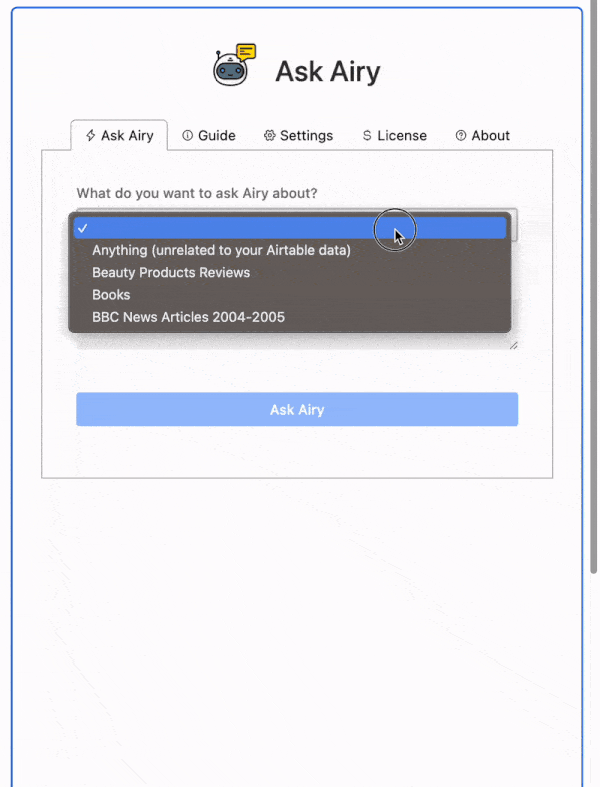
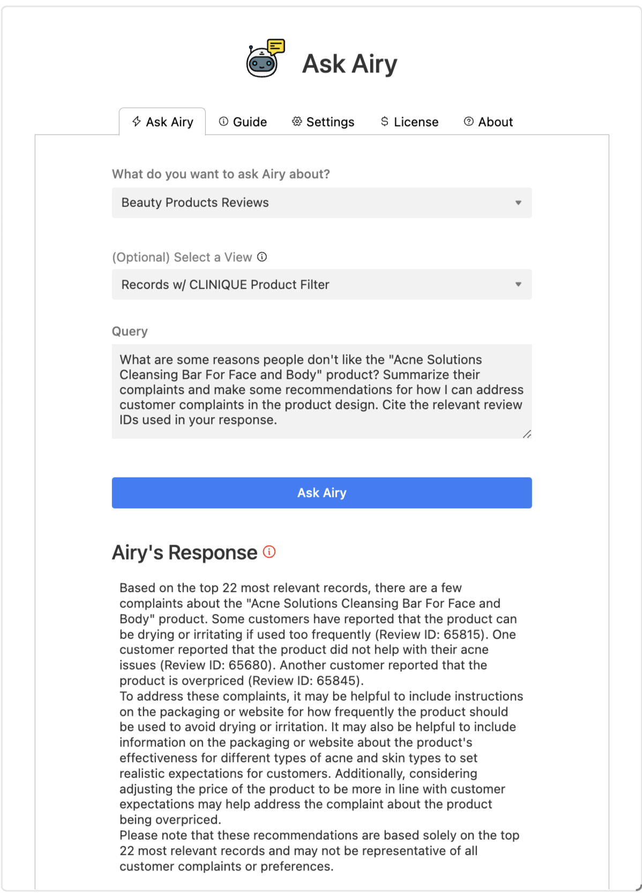
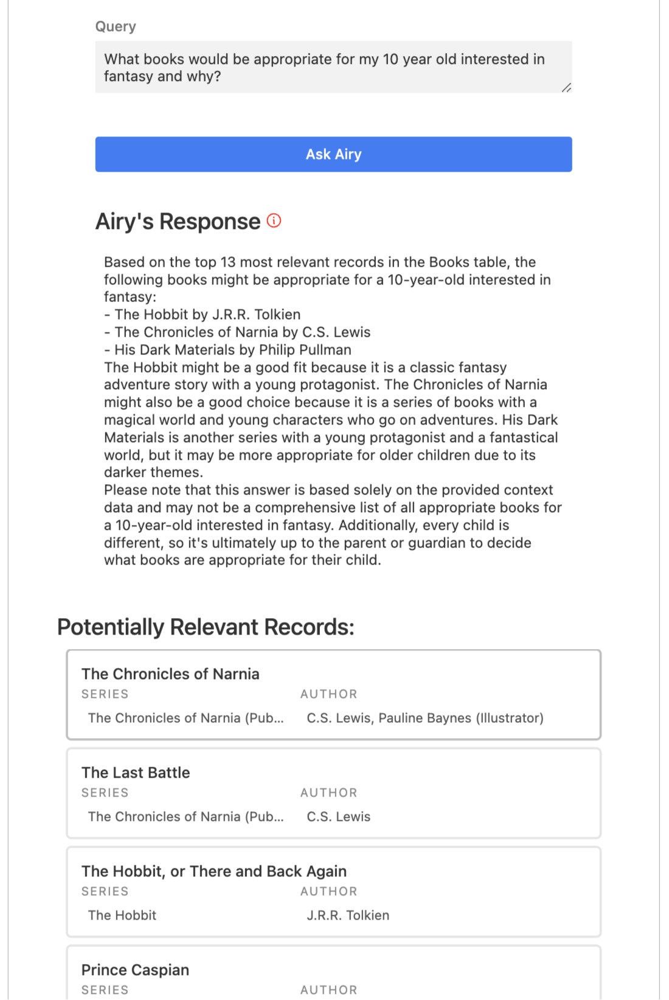

<h1 align="center">
  
</h1>

  <h1>Ask Airy</h1>
An Airtable AI assistant enabling semantic search and GPT-powered Q&A
   
<h5><a href="https://airtable.com/marketplace/blkZopiKHI4kLDmfq/ask-airy" target="_blank">View it on the Airtable Marketplace</a></h5>

 

 

See it in Action

 

 

# How it Works

Ask Airy is an Airtable extension that enables you to intuitively search and query data in Airtable with natural
language using GPT-3.5 and
embeddings-based semantic search.
Let’s say you have a text-heavy database containing, for instance, product/customer reviews. With Ask Airy, you can ask
a question like
“Find and summarize negative reviews. Create a list of action items for improving the product design to address the
feedback.
Cite relevant review IDs in your response.” and get a data-backed response back in natural language.
Airtable is a “no-code” relational database platform with a UI similar to google sheets. While this extension was built
for Airtable, the
architecture/logic is applicable to any application with relational/tabular data.
At its core, the application works by:

1. Generating embeddings using OpenAI’s embeddings endpoint for each row in a table and storing them as another column
   within the
   table.
2. When a user enters a query/question, it generates
   a [hypothetical document embedding](https://wfhbrian.com/revolutionizing-search-how-hypothetical-document-embeddings-hyde-can-save-time-and-increase-productivity/) (
   HyDE) to use for a semantic
   search. ([link to
   code](https://github.com/Zakinator123/ask-airy/blob/main/src/services/OpenAIService.ts#L69))
3. Executes a semantic search via cosine similarity ([link to code](link to code))
4. [Stuffs the most relevant records, along with the user’s original query into a GPT-3.5 prompt](https://github.com/Zakinator123/ask-airy/blob/159dc4e074cf99b5eb856d7c2d6aa01266ee23ee/src/services/OpenAIService.ts#LL115C28-L115C28)
5. Streams the LLM response back to the UI, and shows the user the (potentially) most relevant records for their query.

Takeaways/Lessons:

- All the prompt engineering for this project is in
  the [OpenAIService.ts](https://github.com/Zakinator123/ask-airy/blob/main/src/services/OpenAIService.ts)
  An interesting problem was staying under the RPM/TPM rate limits for the OpenAI embeddings endpoint when bulk
  generating
  embeddings for the database tables. My rate limiter approach can be found here.
- I was able to stream the chat completion response to a React component using npm: openai-streams along with a custom
  [React hook](https://github.com/Zakinator123/ask-airy/blob/main/src/utils/UseReadableStream.ts) I wrote.
- Given that this project employs context stuffing with gpt-3.5, staying under context window token limits was
  important.
  I found that
  estimating tokens with the “[num characters divided by 4](https://platform.openai.com/docs/introduction/tokens)” rule
  of thumb was not reliable, especially when things like
  URLs were in the
  input string. While OpenAI provides a [tokenizer](https://github.com/openai/tiktoken/blob/main/README.md) for counting
  tokens in python, there is no official JS tokenizer.
  I ended up using [npm: gpt3-tokenizer](https://www.npmjs.com/package/gpt3-tokenizer) even though it only provides
  tokenization using the r50k_base encoding. GPT 3.5+
  uses the
  cl100k_base encoding, but I found that their tokenization outputs were similar enough.

## License

This project is licensed under the **MIT license**.

See [LICENSE](LICENSE) for more information.