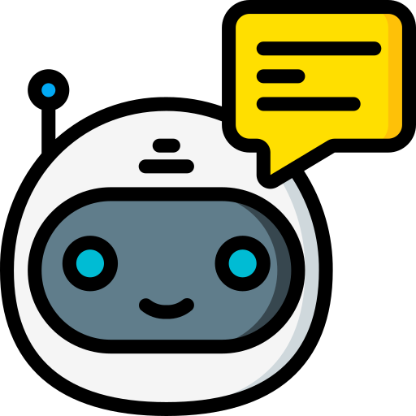

<h1 align="center">
  
</h1>

  <h1>Ask Airy</h1>
Ask an AI anything about your Airtable Base.
   

 

 

## License

This project is licensed under the **MIT license**.

See [LICENSE](LICENSE) for more information.